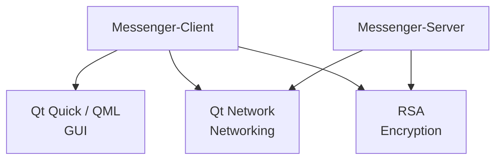

# Messenger

Messenger is a cross-platform client-server messenger application based on the RSA algorithm. The project is still in an early stage and currently provides the foundation for the client and server.

## Architecture

The repository contains two applications: `Messenger-Client` and `Messenger-Server`. The client is built with Qt/QML; the server is a terminal program.

Both applications use a singleton through `getInstance()`. The project is built with CMake and C++20, with the RSA library included as a submodule.

## Dependencies



The application depends on the RSA library for encryption, Qt Quick/QML for the graphical client, and Qt Network for networking functionality.

## Setup

> [!NOTE]
> Qt must be installed locally for the client so CMake can resolve `find_package(Qt6 COMPONENTS Quick Qml REQUIRED)`. The official installation guide is available in the [Qt documentation](https://doc.qt.io/qt-6/get-and-install-qt.html).

Clone the repository including its submodules:

```bash
git clone --recurse-submodules https://github.com/ParallelEngineering/Messenger.git
```

If the repository has already been cloned without submodules, they can be initialized recursively with remote updates:

```bash
git submodule update --init --recursive --remote
```

## Build

The project can be configured and built with CMake:

```bash
cmake -S . -B cmake-build-debug
cmake --build cmake-build-debug
```

This creates the `Messenger-Client` and `Messenger-Server` targets.
