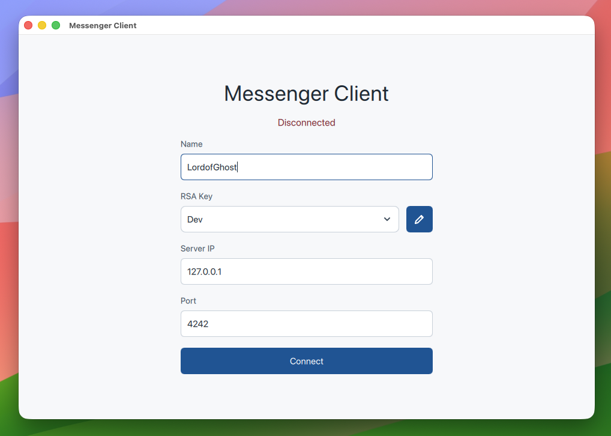
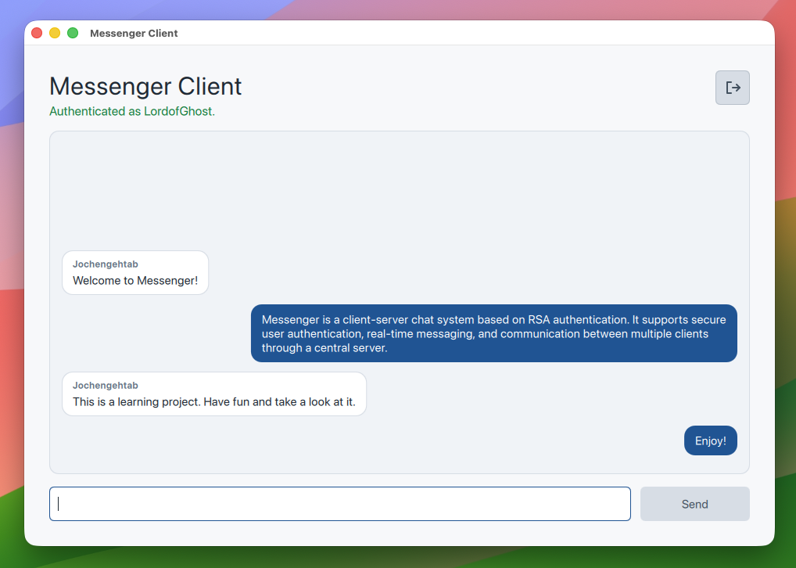
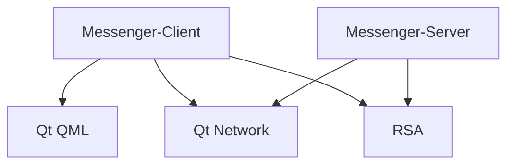

# Messenger

Messenger is a simple chat program with a client and a server. Users can connect to a server, send messages, receive messages, and see the previous chat history. The messenger is intentionally kept simple because it is mainly a learning project focused on networking and encryption, including RSA-based authentication built with a self-implemented RSA library.

<p align="center">
  
  
</p>

## Functionality

- **Client connection:** enter a server host, connect to the server, disconnect again when terminating the program, and see the current connection status in the UI.
- **Group chat authentication:** each server represents one group chat; clients request access with a name and their public key, without passwords. After server-side approval, they authenticate through RSA-based verification using the stored public key.
- **Message sending:** compose text messages and send them to the connected server.
- **Message receiving:** display incoming messages in the client window as they arrive from the server.
- **Group chat forwarding:** the server keeps track of the clients connected to its group chat and broadcasts chat messages to every active session.
- **Chat history:** the server stores the group chat history and sends all previous messages to newly connected clients.
- **Protocol validation:** client and server exchange structured messages and reject unsupported protocol versions.
- **Error handling:** connection errors and invalid client-side input are surfaced through the status text and message log.

## Architecture

The repository contains two applications, `Messenger-Client` and `Messenger-Server`, as well as a shared protocol library. Communication is based on TCP and serialized with `QDataStream`.

- **Client:** the graphical Qt Quick/QML interface delegates connection handling to `NetworkManager`. It manages the TCP socket, the authentication state machine, RSA challenge signing, and the sending and receiving of protocol messages. `ConnectionStore` stores past connection and handles RSA keys.
- **Shared protocol:** `src/shared` defines the versioned message format, message types, protocol limits, nonce generation, and the canonical authentication transcript used by both applications.
- **Server:** the terminal-based server accepts connections through `QTcpServer` and creates one `Session` per client. A session owns its socket and authentication state, while the central server validates incoming messages, persists chat messages, and broadcasts them to authenticated sessions.
- **Persistence:** `MessageStore` encapsulates the SQLite database. It applies migrations and stores users, public keys, registration requests, and chat history. Private RSA keys remain exclusively on the clients.

After a TCP connection is established, the client and server perform a challenge-response handshake. The client signs a transcript containing fresh client and server nonces with its private RSA key; the server verifies the signature with the stored public key. Only then is the session marked as authenticated and allowed to receive the chat history or exchange chat messages. Unknown users first create a registration request that must be approved through the server CLI. A detailed sequence is documented in [Connection Establishment and Client Authentication](docs/connection-establishment.md).

## Dependencies


```mermaid
flowchart TD
    Client["Messenger-Client"]
    Server["Messenger-Server"]
    RSA["RSA"]
    QtGUI["Qt QML"]
    QtNetwork["Qt Network"]

    Client --> QtGUI
    Client --> QtNetwork
    Server --> QtNetwork
    Client --> RSA
    Server --> RSA

    click QtGUI "https://doc.qt.io/qt-6/qtquick-index.html" "Qt Quick/QML documentation"
    click QtNetwork "https://doc.qt.io/qt-6/qtnetwork-index.html" "Qt Network documentation"
    click RSA "https://github.com/ParallelEngineering/RSA"
```

The application depends on the RSA library for encryption, Qt Quick/QML for the graphical client, and Qt Network for networking functionality.

## Setup

> [!NOTE]
> Qt must be installed locally for the client so CMake can resolve `find_package(Qt6 COMPONENTS Quick Qml REQUIRED)`. The official installation guide is available in the [Qt documentation](https://doc.qt.io/qt-6/get-and-install-qt.html).

Clone the repository including its submodules:

```bash
git clone --recurse-submodules https://github.com/ParallelEngineering/Messenger.git
```

If the repository has already been cloned without submodules, they can be initialized recursively with remote updates:

```bash
git submodule update --init --recursive
```

## Build

The project can be configured and built with CMake:

```bash
cmake -S . -B cmake-build-debug
cmake --build cmake-build-debug
```

This creates the `Messenger-Client` and `Messenger-Server` targets.
