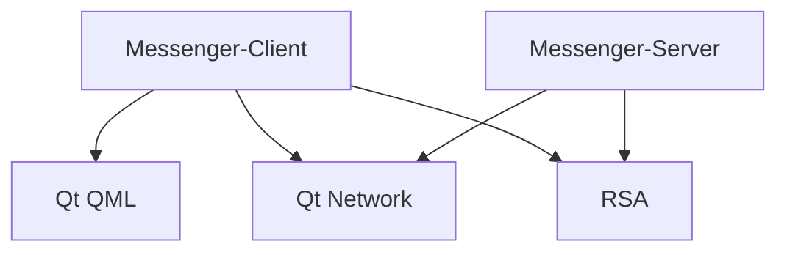

# Messenger

Messenger is a simple chat program with a client and a server. Users can connect to a server, send messages, receive messages, and see the previous chat history. The messenger is intentionally kept simple: there is only one chat on each server, because the project is mainly a learning project focused on networking and encryption.

## Functionality

- **Client connection:** enter a server host, connect to the server, disconnect again when terminating the program, and see the current connection status in the UI.
- **Group chat authentication:** each server represents one group chat; clients request access with a name and their public key, without passwords. After server-side approval, they authenticate through RSA-based verification using the stored public key.
- **Message sending:** compose text messages and send them to the connected server.
- **Message receiving:** display incoming messages in the client window as they arrive from the server with timestamp and username.
- **Group chat forwarding:** the server keeps track of the clients connected to its group chat and broadcasts chat messages to every active session.
- **Chat history:** the server stores the group chat history and sends all previous messages to newly connected clients.
- **Protocol validation:** client and server exchange structured messages and reject unsupported protocol versions.
- **Error handling:** connection errors and invalid client-side input are surfaced through the status text and message log.

## Architecture

The repository contains two applications: `Messenger-Client` and `Messenger-Server`. The client is built with Qt/QML; the server is a terminal program.

Both applications use a singleton through `getInstance()`. The project is built with CMake and C++20, with the RSA library included as a submodule.

## Dependencies


```mermaid
flowchart TD
    Client["Messenger-Client"]
    Server["Messenger-Server"]
    RSA["RSA"]
    QtGUI["Qt QML"]
    QtNetwork["Qt Network"]

    Client --> QtGUI
    Client --> QtNetwork
    Server --> QtNetwork
    Client --> RSA
    Server --> RSA

    click QtGUI "https://doc.qt.io/qt-6/qtquick-index.html" "Qt Quick/QML documentation"
    click QtNetwork "https://doc.qt.io/qt-6/qtnetwork-index.html" "Qt Network documentation"
    click RSA "https://github.com/ParallelEngineering/RSA"
```

The application depends on the RSA library for encryption, Qt Quick/QML for the graphical client, and Qt Network for networking functionality.

## Setup

> [!NOTE]
> Qt must be installed locally for the client so CMake can resolve `find_package(Qt6 COMPONENTS Quick Qml REQUIRED)`. The official installation guide is available in the [Qt documentation](https://doc.qt.io/qt-6/get-and-install-qt.html).

Clone the repository including its submodules:

```bash
git clone --recurse-submodules https://github.com/ParallelEngineering/Messenger.git
```

If the repository has already been cloned without submodules, they can be initialized recursively with remote updates:

```bash
git submodule update --init --recursive --remote
```

## Build

The project can be configured and built with CMake:

```bash
cmake -S . -B cmake-build-debug
cmake --build cmake-build-debug
```

This creates the `Messenger-Client` and `Messenger-Server` targets.

## User registration

When a client connects with an unknown username, the server stores a pending registration request and the client is told to try again after an administrator has reviewed it. The private key always remains on the client.

Use the server executable from a terminal to review requests in the same database:

```bash
Messenger-Server requests
Messenger-Server approve 1
Messenger-Server reject 2
```

After approval, the client connects again manually and uses the normal RSA authentication flow. No administrator account or manually installed public-key file is required.

Existing users can be listed and completely removed by ID. Deletion also removes that user's messages and registration requests, so the username can be registered again later:

```bash
Messenger-Server users
Messenger-Server delete-user 1
```
