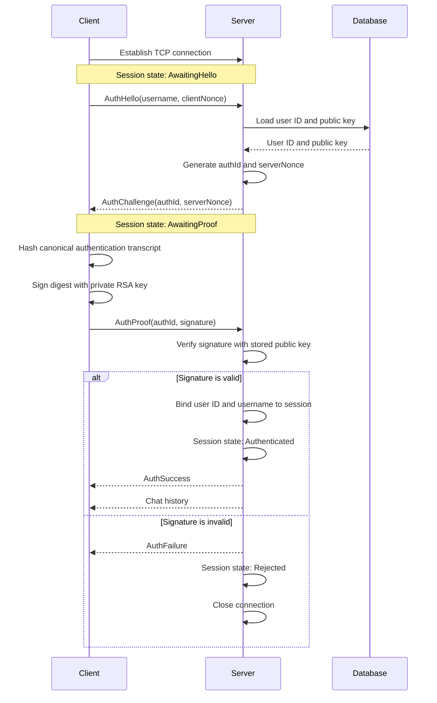

# Connection Establishment and Client Authentication

## Purpose

The Messenger server must authenticate every client immediately after the TCP connection is established. A client is authenticated by proving that it owns the private RSA key belonging to a public key stored for its user account in the server database.

The private key never leaves the client. The server stores only public keys. Initially, the database contains only the `admin` user and the admin public key loaded during server initialization.

The authentication flow is inspired by SSH public-key authentication and deliberately kept small enough for this learning project.

## Security goals

The connection establishment must ensure that:

- a TCP connection alone does not grant access to server functionality;
- a client must prove possession of the matching private RSA key;
- an authentication response cannot be reused for a later connection;
- the authenticated user identity is bound to the server-side session;
- the client cannot select or change its sender identity after authentication;
- chat history and other application data are sent only after authentication;
- failed, malformed, or timed-out authentication attempts are disconnected;
- private keys are never transmitted to or stored on the server.

This design authenticates the client to the server. It does not, by itself, authenticate the server to the client or encrypt chat traffic. TLS or an SSH-like pinned server host key can be added separately for those properties.

## Existing project state

The project already provides the main building blocks:

- `users` contains a unique username and a serialized RSA public key;
- the server imports the initial admin public key from `admin.public.rsa`;
- `MessageStore::hasUser()` can determine whether a username exists;
- `Session` represents one TCP connection;
- client and server exchange versioned messages through `QDataStream`;
- the RSA library provides key serialization, `BigInt`, and modular exponentiation;
- Qt provides SHA-256 through `QCryptographicHash`.

The current server behavior is not yet authenticated:

- chat history is sent as soon as a TCP client connects;
- the first chat message binds its self-declared sender name to the session;
- the client considers an established TCP socket to be fully connected;
- the existing RSA API supports encryption and decryption, but no signature API.

These behaviors must be replaced by the flow below.

## Protocol overview



## Authentication messages

Authentication messages are protocol messages, but they should have dedicated payload structures instead of overloading the chat `Message` fields.

```cpp
enum class MessageType : quint32 {
    AuthHello = 1,
    AuthChallenge = 2,
    AuthProof = 3,
    AuthSuccess = 4,
    AuthFailure = 5,

    ChatMessage = 100,
    SystemMessage = 101,
    ErrorMessage = 102,
};
```

Suggested payloads:

```cpp
struct AuthHello {
    QString username;
    QByteArray clientNonce; // Exactly 32 bytes
};

struct AuthChallenge {
    QByteArray authId;      // Exactly 16 bytes
    QByteArray serverNonce; // Exactly 32 bytes
};

struct AuthProof {
    QByteArray authId;
    QByteArray signature;
};

struct AuthResult {
    bool success;
    QString reason; // Generic, non-sensitive error text
};
```

Every serialized protocol frame must continue to include `protocolVersion` and `messageType`. Payload lengths must be validated before allocating or processing data.

## Authentication transcript

The signature must cover the full connection-specific context, not only the server nonce. Client and server independently create the same canonical byte sequence:

```text
domainSeparator  = "MessengerAuth/v1"
protocolVersion  = CurrentProtocolVersion
username         = normalized username from AuthHello
authId           = random authentication attempt ID
clientNonce      = random client nonce
serverNonce      = random server nonce
```

Conceptually:

```text
authData = Encode(
    domainSeparator,
    protocolVersion,
    username,
    authId,
    clientNonce,
    serverNonce
)

digest = SHA-256(authData)
```

`Encode` must be deterministic. It should use fixed field order, explicit length prefixes, UTF-8 for the username, and fixed-size integer encoding. Client and server must use the same `QDataStream` version and byte order. Concatenating ambiguous strings without lengths is not permitted.

The domain separator prevents a signature produced for a different feature or protocol from being accepted as a Messenger login proof.

## Using the existing RSA library

### What can be reused

The current RSA library can remain the basis of the implementation. The following parts are reusable:

- `PublicKey` and `PrivateKey`;
- key serialization and deserialization;
- `operations::BigInt`;
- `operations::math::modPow()`;
- the existing 4096-bit key generation;
- operating-system-backed random generation already used during key generation.

Qt's `QCryptographicHash` can provide SHA-256, so another library is not required for the initial learning implementation.

### What must not be used unchanged

The existing `core::encryptor::encrypt()` must not be used to encrypt the authentication challenge. It encrypts every plaintext byte independently and deterministically. An observer can encrypt all 256 possible byte values with the public key and use the resulting lookup table to recover the challenge without possessing the private key.

Consequently, the following flow is not acceptable:

```text
server encrypts a string challenge with encrypt()
client decrypts it with decrypt()
client returns the plaintext challenge
```

### Minimal signature extension

For the initial learning version, add a small digest-signing API to the RSA library:

```cpp
namespace core::signature {

std::vector<std::uint8_t> signDigest(
    const PrivateKey& privateKey,
    const std::vector<std::uint8_t>& digest);

bool verifyDigest(
    const PublicKey& publicKey,
    const std::vector<std::uint8_t>& digest,
    const std::vector<std::uint8_t>& signature);

} // namespace core::signature
```

The minimal implementation uses the existing modular exponentiation:

```text
digestInteger = OS2IP(SHA-256(authData))
signature     = digestInteger^d mod n
verifiedValue = signature^e mod n
valid         = verifiedValue == digestInteger
```

`OS2IP` converts the 32-byte digest to one unsigned integer using a documented byte order. Signatures should be serialized to the fixed byte length of the RSA modulus so that leading zero bytes are preserved. Verification must reject signatures that are empty, incorrectly sized, or greater than or equal to the modulus.

This direct hash-and-RSA construction demonstrates private-key possession and is suitable only for the project's first educational implementation. It is not equivalent to a standardized SSH signature scheme.

### Planned security upgrade

The signature API should later implement RSA-PSS with SHA-256 and MGF1:

```text
signature = RSA-PSS-Sign(privateKey, SHA-256(authData))
valid     = RSA-PSS-Verify(publicKey, SHA-256(authData), signature)
```

The network handshake and message structures do not need to change when the internal implementation moves from the learning scheme to RSA-PSS. A future protocol version or signature-algorithm field should identify the selected algorithm if both variants are supported at the same time.

## Server-side session state

`Session` must explicitly track authentication state:

```cpp
enum class AuthenticationState {
    AwaitingHello,
    AwaitingProof,
    Authenticated,
    Rejected,
};
```

Suggested session data:

```cpp
AuthenticationState authenticationState_;
int authenticatedUserId_;
QString authenticatedUserName_;
PublicKey authenticationPublicKey_;
QByteArray authId_;
QByteArray clientNonce_;
QByteArray serverNonce_;
QDeadlineTimer authenticationDeadline_;
```

Only one message type is valid in each unauthenticated state:

| Session state | Accepted client message | All other messages |
|---|---|---|
| `AwaitingHello` | `AuthHello` | Reject and disconnect |
| `AwaitingProof` | `AuthProof` | Reject and disconnect |
| `Authenticated` | Authorized application messages | Handle normally |
| `Rejected` | None | Disconnect |

An authentication attempt should expire after a short fixed interval, for example 10 seconds. Each challenge is valid only for its originating `Session`, only for its matching `authId`, and only once. Challenge data must be cleared after success, failure, timeout, or disconnect.

## Detailed server flow

### 1. Accept TCP connection

Create a `Session` in `AwaitingHello`. Do not send chat history and do not expose other application functionality.

### 2. Process `AuthHello`

The server:

1. verifies the protocol version and message shape;
2. normalizes and validates the username;
3. verifies that `clientNonce` is exactly 32 bytes;
4. loads the user ID, canonical username, and serialized public key from the database;
5. validates and deserializes the public key;
6. creates a cryptographically random 16-byte `authId`;
7. creates a cryptographically random 32-byte `serverNonce`;
8. stores all authentication context in the `Session`;
9. changes the state to `AwaitingProof`;
10. sends `AuthChallenge`.

Unknown users should receive the same generic failure behavior as invalid signatures so that authentication errors reveal as little account information as practical.

### 3. Process `AuthProof`

The server:

1. verifies that the session is in `AwaitingProof`;
2. verifies that the attempt has not expired;
3. compares the received `authId` with the session value;
4. reconstructs the canonical authentication transcript;
5. calculates its SHA-256 digest;
6. verifies the signature using the public key loaded for this session;
7. invalidates the challenge regardless of the result.

On success, the server stores the database user ID and canonical username in the session, changes its state to `Authenticated`, sends `AuthSuccess`, and then sends the chat history.

On failure, the server sends a generic `AuthFailure`, marks the session as `Rejected`, and closes the socket. It must not allow a second proof attempt for the same challenge.

## Authorization after authentication

Authentication establishes the session identity. Every server action must still begin with an authorization check:

```cpp
if (!session->isAuthenticated()) {
    session->disconnectFromHost();
    return;
}
```

For incoming chat messages, the server must ignore any sender name supplied by the client and set it from the session:

```cpp
Message verifiedMessage = incomingMessage;
verifiedMessage.senderName = session->authenticatedUserName();
verifiedMessage.timestamp = QDateTime::currentDateTimeUtc();
```

Preferably, client chat payloads should no longer contain `senderName` at all. The server is the authority for both sender identity and the timestamp used for ordering and storage.

Broadcasting must also target only authenticated sessions. An unauthenticated TCP connection must not receive chat messages, history, user data, or administrative responses.

## Client state

The client must distinguish TCP connectivity from successful authentication:

```cpp
enum class ConnectionState {
    Disconnected,
    Connecting,
    Authenticating,
    Authenticated,
    Disconnecting,
};
```

`QTcpSocket::connected` changes the state to `Authenticating`, not `Authenticated`. Chat controls remain disabled until `AuthSuccess` is received. Only the authenticated state should be exposed to the existing UI as ready for messaging.

The client flow is:

1. load and validate its private key before connecting;
2. establish the TCP connection;
3. generate a fresh 32-byte `clientNonce`;
4. send `AuthHello`;
5. validate `AuthChallenge` and its field sizes;
6. construct the canonical transcript and calculate SHA-256;
7. sign the digest with the private key;
8. send `AuthProof`;
9. clear temporary authentication data;
10. enable messaging only after `AuthSuccess`.

Failure to load the private key must prevent connection authentication and produce a clear local error. The private key must never be logged or included in an error message.

## Database access

The existing schema is sufficient for the initial implementation:

```sql
CREATE TABLE users (
    id INTEGER PRIMARY KEY AUTOINCREMENT,
    username TEXT NOT NULL UNIQUE,
    public_key BLOB NOT NULL,
    created_at TEXT NOT NULL
);
```

`MessageStore` needs a lookup that returns the user record and public key rather than only a Boolean:

```cpp
struct UserAuthenticationRecord {
    int userId;
    QString username;
    QByteArray publicKey;
};

std::optional<UserAuthenticationRecord>
findUserForAuthentication(const QString& username) const;
```

The admin bootstrap remains unchanged: the server validates `admin.public.rsa` and stores it for the initial `admin` account. Future user-management functionality can allow an authenticated and authorized admin to add more usernames and public keys.

## Randomness and replay protection

Both nonces and `authId` must come from a cryptographically secure operating-system random source. `std::rand()`, timestamps, counters, and regular pseudo-random generators are not sufficient.

Replay protection is provided by:

- a new `clientNonce` for every client attempt;
- a new `serverNonce` and `authId` for every server session;
- binding all values to the signature;
- accepting each challenge only once;
- applying a short authentication deadline;
- keeping challenge state inside the originating session.

A previously recorded `AuthProof` therefore cannot authenticate a new connection because its transcript will contain different nonces and a different `authId`.

## Failure handling

The server should close the connection for:

- an unsupported protocol version;
- an unexpected message type for the current state;
- malformed or oversized fields;
- an empty or invalid username;
- an unknown user;
- a missing or invalid public key;
- an incorrect `authId`;
- an expired challenge;
- an invalid signature;
- more than one authentication attempt on the same session.

External errors should stay generic, for example `Authentication failed`. Detailed reasons may be logged on the server, but logs must not include private material, full authentication payloads, or reusable secrets. Repeated failures should eventually be rate-limited by source address and username.

## Required code changes

### Shared protocol

- add authentication message types and payload serialization;
- define strict size limits and canonical transcript encoding;
- increment `CurrentProtocolVersion` because the connection behavior changes incompatibly.

### RSA library

- add `signDigest(PrivateKey, digest)`;
- add `verifyDigest(PublicKey, digest, signature)`;
- add fixed-width signature serialization and strict input validation;
- add unit tests for valid, invalid, modified, and wrong-key signatures;
- later replace the minimal implementation with RSA-PSS.

### Server storage

- add `findUserForAuthentication()`;
- return the database user ID, canonical username, and public key;
- keep the existing admin public-key bootstrap.

### Server session

- add the authentication state and temporary challenge data;
- add the authentication deadline;
- expose authenticated user ID and username only after success;
- reject unexpected pre-authentication traffic.

### Server

- stop sending history from `handleNewConnection()`;
- handle `AuthHello` and `AuthProof` before application messages;
- send history only after successful authentication;
- remove the self-declared username binding from the first chat message;
- derive all message identities from the authenticated session;
- broadcast only to authenticated sessions.

### Client

- load the private key from a configured local file;
- implement connection and authentication states;
- send `AuthHello` after the socket connects;
- sign `AuthChallenge` and send `AuthProof`;
- keep chat input disabled until `AuthSuccess`;
- clear temporary authentication values after completion.

## Verification plan

At minimum, automated tests should cover:

1. the admin authenticates with the matching private key;
2. authentication fails with a different private key;
3. authentication fails for an unknown username;
4. changing the username, nonce, `authId`, or signature causes failure;
5. replaying a proof in a new connection causes failure;
6. replaying a proof twice in one connection causes disconnection;
7. an expired challenge causes failure;
8. chat messages before authentication cause disconnection;
9. unauthenticated sessions receive neither history nor broadcasts;
10. the server replaces or ignores a client-provided sender name;
11. malformed and oversized authentication messages are rejected;
12. the client UI enables messaging only after `AuthSuccess`;
13. signature serialization preserves leading zero bytes;
14. signing with one key and verification with another key fails.

## Implementation order

1. Add and test digest signing and verification in the RSA library.
2. Add authentication protocol payloads and canonical transcript encoding.
3. Add the public-key lookup to `MessageStore`.
4. Add the authentication state machine to `Session`.
5. Implement the server-side handshake and move history delivery after authentication.
6. Implement private-key loading and the client-side handshake.
7. Remove trust in client-provided sender names.
8. Add integration tests for success, failure, replay, timeout, and pre-authentication access.
9. Upgrade the RSA signature implementation to RSA-PSS before treating the protocol as production security.

## Final connection rule

The central rule is:

```text
TCP connected != authenticated
```

Until the RSA proof has been verified, the connection may process only the authentication handshake. After successful verification, the server binds the database user to the session and permits authorized application messages. Any deviation from the expected handshake closes the connection.
