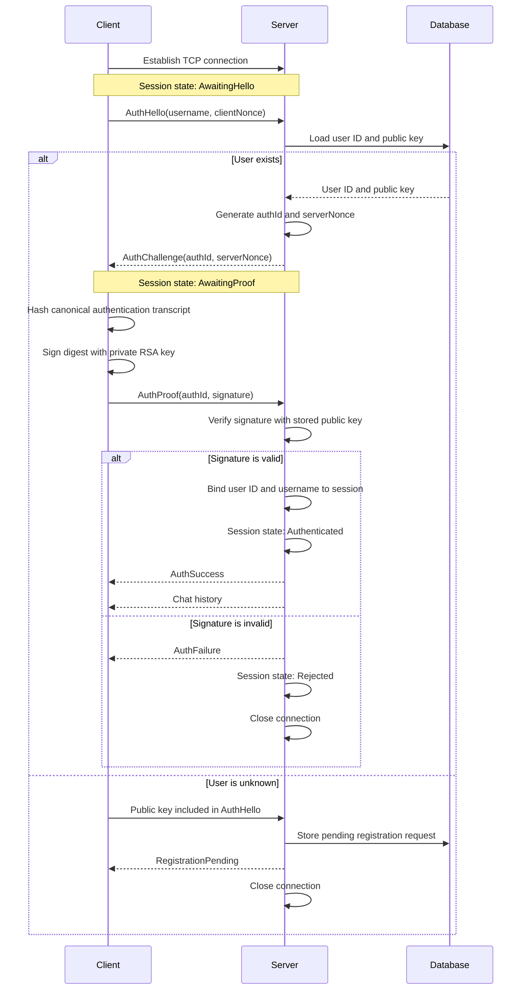

# Connection Establishment and Client Authentication

## Purpose

Every client must authenticate immediately after establishing a TCP connection. Authentication proves that the client owns the private RSA key matching the public key stored for its user account in the server database.

The private key remains on the client. The server stores only public keys. There is no predefined administrator account: an unknown username creates a pending registration request that is approved or rejected with the server command-line interface.

## Protocol overview



## Authentication messages

Protocol version 3 defines the following message types:

```cpp
enum class MessageType : quint32 {
    AuthHello = 1,
    AuthChallenge = 2,
    AuthProof = 3,
    AuthSuccess = 4,
    AuthFailure = 5,
    RegistrationPending = 6,
    RegistrationRejected = 7,
    ChatMessage = 100,
    SystemMessage = 101,
    ErrorMessage = 102,
};
```

The handshake uses these fields:

| Message | Content |
|---|---|
| `AuthHello` | Username, a 32-byte `clientNonce`, and the client's public key |
| `AuthChallenge` | 16-byte `authId` and 32-byte `serverNonce` |
| `AuthProof` | Matching `authId` and RSA signature |
| `AuthSuccess` | Canonical authenticated username |
| `AuthFailure` | Generic authentication error |
| `RegistrationPending` | The unknown user's access request is waiting for server approval |
| `RegistrationRejected` | The matching access request was rejected |

All messages include the protocol version and message type. Field sizes and the expected message order are validated by both sides.

## Authentication proof

Client and server independently create the same canonical authentication transcript:

```text
domainSeparator = "MessengerAuth/v1"
protocolVersion = CurrentProtocolVersion
username        = normalized username
authId          = random authentication attempt ID
clientNonce     = random client nonce
serverNonce     = random server nonce
```

The values are encoded in a fixed order with `QDataStream`. The client calculates the digest with Qt:

```text
digest = SHA-256(authenticationTranscript)
```

The RSA library performs the signature operation using its existing `BigInt` and `modPow` implementation:

```text
digestInteger = BigInt(digest)
signature     = digestInteger^d mod n
```

The server loads the user's public key from the database and verifies:

```text
verifiedDigest = signature^e mod n
valid          = verifiedDigest == digestInteger
```

The signature has the fixed byte length of the RSA modulus. Empty, incorrectly sized, or out-of-range signatures are rejected.

## Session states

Each server-side connection has an authentication state:

```cpp
enum class AuthenticationState {
    AwaitingHello,
    AwaitingProof,
    Authenticated,
    Rejected,
};
```

| Session state | Accepted client message | Other messages |
|---|---|---|
| `AwaitingHello` | `AuthHello` | Reject and disconnect |
| `AwaitingProof` | `AuthProof` | Reject and disconnect |
| `Authenticated` | Authorized application messages | Reject invalid messages |
| `Rejected` | None | Disconnect |

Authentication must finish within 30 seconds. The challenge belongs to one TCP session, matches one `authId`, and can be used only once. Temporary authentication data is cleared after success, failure, timeout, or disconnect.

## Server behavior

After accepting a TCP connection, the server waits for `AuthHello` without sending chat history or other application data.

For `AuthHello`, the server:

1. validates the username and client nonce;
2. loads the user ID, canonical username, and public key from the database;
3. generates a random authentication ID and server nonce;
4. stores the authentication context in the session;
5. sends `AuthChallenge`.

If the username does not exist, the server validates the public key from `AuthHello`, stores an idempotent pending request for that username and key, sends `RegistrationPending`, and closes the connection. A rejected matching request produces `RegistrationRejected`. The administrator reviews requests with `Messenger-Server requests` and decides with `Messenger-Server approve <id>` or `Messenger-Server reject <id>`.

The administrator can list accounts with `Messenger-Server users` and remove an account with `Messenger-Server delete-user <id>`. Deletion removes the user, their stored messages, and all registration requests for that username in one transaction.

The command `Messenger-Server clear-history` deletes all stored chat messages without changing users or registration requests.

For a known user and `AuthProof`, the server reconstructs the transcript, calculates its SHA-256 digest, and verifies the signature with the stored public key. On success, it binds the user ID and username to the session, sends `AuthSuccess`, and then sends the chat history. On failure, it sends `AuthFailure` and closes the connection.

Only authenticated sessions may send or receive chat messages. The server sets the sender name and timestamp itself:

```cpp
Message verifiedMessage = incomingMessage;
verifiedMessage.senderName = session->userName();
verifiedMessage.timestamp = QDateTime::currentDateTimeUtc();
```

Chat history and broadcasts are sent only to authenticated sessions.

## Client behavior

The client distinguishes an established TCP socket from an authenticated connection:

```cpp
enum class ConnectionState {
    Disconnected,
    Connecting,
    AwaitingChallenge,
    SigningChallenge,
    AwaitingAuthenticationResult,
    Authenticated,
};
```

After the TCP socket connects, the client generates `clientNonce` and sends `AuthHello`, including the selected public key. After receiving `AuthChallenge`, it creates and signs the authentication digest and sends `AuthProof`.

For `RegistrationPending` or `RegistrationRejected`, the client shows the corresponding access status and disconnects. It does not reconnect automatically; after an approval the user simply tries to connect again.

The chat UI remains disabled until `AuthSuccess` is received. The existing status display reports the current step, including connection, challenge processing, signature creation, verification, success, timeout, and failure.

## Replay protection and failure handling

Every authentication attempt uses a new client nonce, server nonce, and authentication ID. All three values are covered by the signature, so a recorded `AuthProof` cannot authenticate another connection.

The server closes the connection for malformed messages, unexpected message types, invalid keys, an incorrect authentication ID, timeout, or an invalid signature. Unknown users receive a pending or rejected registration result. Private key material is never logged or transmitted.

## Connection rule

```text
TCP connected != authenticated
```

Before RSA verification succeeds, the connection may process only authentication messages. After verification, the database user is bound to the session and application messages are permitted.
